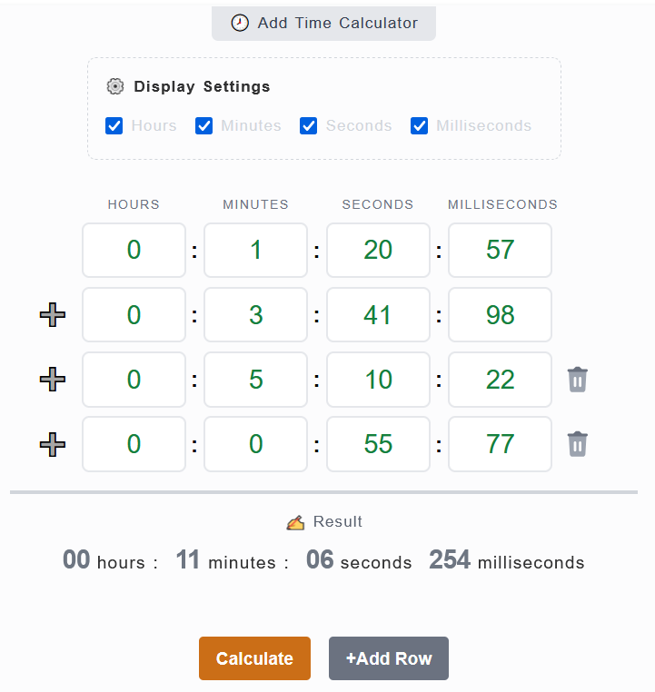

# **A COMUNIDADE TOP GEAR CHAMPIONSHIPS (TGC) APRESENTA:** #

# **TGC Time Attack 2025** #

# **LEIA TODAS AS REGRAS COM BASTANTE ATENÇÃO!!!** #

# **1. Incrições:** #

1.1 - O novo modelo de inscrições de campeonatos da TGC terá sempre uma pré-lista de inscritos já validados e ativos conforme os participantes dos campeonatos recentes. Conforme Lista a seguir:

- Albert Matos (Suprem Peruvian)
- Aléxis Sánchez (ChitaMX)
- Alison Paulo (Jack Maloi)
- Allan Live (Allan Live)
- Amélio Belchior (Amélio)
- Anderson Policarpo (Policarpo)
- Ari Júnior (Arijunino)
- Carlos José (Carlos CJX)
- Carlos Rubens (Carlos CRX)
- Casio Aquino (CFDA)
- Brisantt (BR Brissant)
- Edimar Caetano (Pegasus PSX)
- Edwin Huaylla (HD Wins)
- Javier Portillo (Javier VZLA)
- Jhonny Mota (Jhonny)
- Jurandir Filho (Sr. Filho)
- Laynara Souza (UaiLay)
- Lenno Coelho (LeNN Miner)
- Leonardo Andrade (Leomarx Games)
- Luciano Alves (Luciano Bora Zerar)
- Luís Cárdenas (Luís L.A.O.M.)
- Marcel Santana (MMM)
- Marlon Fernandes (Camus Kshrc)
- Martins Pazos (Schumacher)
- Óscar Cárdenas (Goku L.A.O.M.)
- Paulo Muniz (Paulo Fox)
- Petter Bruno (JackPoker40)
- Rafael Lopes (Rafael Diablo)
- Reeh Taylor (Fe & Har)
- Roberto Vasquez (The Mister)
- Robson Meireles (Rob Jax)
- Ronald Daniel (RonalDan)

1.2 - Novos participantes poderão se inscrever através de postagem realizada diretamente nos comentários do vídeo de divulgação do Torneio nas Redes Sociais da Comunidade TGC.

    Exemplo:
    Apelido/Nickname: LeomarxGames
    Nome Real: Leonardo Andrade

1.3. Em seguida deverá ingressar no grupo de WhatsApp do Campeonato pelo Link [Link Aqui](https://chat.whatsapp.com/BYn03caDFPU4QKepWxuaeV) e se apresentar com o seu Nome Real + Apelido/NickName

# **2 - Validação e Verificação de Perfil dos Inscritos:** #

2.1 - A administração da TGC, na intenção de criar um campeonato com credibilidade, se reserva no direito de solicitar a qualquer momento durante a inscrição e/ou durante o campeonato, informações adicionais a qualquer um dos inscritos em seus campeonatos.

2.2 - Tais medidas, vem com o intuito de impedir a inscrição ou participação de jogadores com contas fakes.

2.3 - As informações solicitadas servem para um processo de verificação/confirmação de identidade, tais como:

- Perfil de rede social com foto (Facebook/Instagram/WhatsApp/Discord/Telegram/Twitter/TikTok/Outras).
- Vídeo chamadas por qualquer uma das redes sociais mencionadas que o participante tenha conta.
- Detalhes técnicos e verificação do processo de conexão online (Hamachi/Radmin/ZeroTier), compartilhando a tela. (TeamViewer/AnyDesk/Outros)
- Tipo de computador, fotos do modem, Empresa de internet, IP virtual, IP do roteador, VPN, etc.

2.4 - O jogador inscrito tem o **direito de não fornecer as informações solicitadas**, assim como a TGC, também se reserva ao **direito de cancelar a inscrição ou remover um participante durante um campeonato**, que não concorde em providenciar as informações que lhe forem solicitadas.

# **3 - Itens Obrigatórios:** #

3.1 - **Emulador ZSNES 1.42 =** Link para download [aqui](https://www.zsnes.com/index.php?page=files)

3.2 - **ROM Top Gear TGC (E) [!].smc** = Link para download [aqui](https://www.facebook.com/groups/topgearchampionships/files/files)

# **4 - Cronograma (Previsão):** #

4.1 - Após confirmação das inscrições, será realizado o sorteio das pistas, sendo liberado o primeiro grupo de pistas até 04/03/2025.

4.2 - Se o torneio se iniciar com 20 participantes o torneio terá duração de 20 rodadas, não ultrapassando o final do mês novembro de 2025.

4.3 - Devido a concorrência de outros torneios os prazos serão de 7 dias iniciando-se na terça às 0h01 e finalizando na segunda feira 23h59.

4.4 - Ainda que já se tenha o conhecimento da próxima rodada a serem jogados, não serão permitida a realização e nem a postagem de resultados de partidas nem antes e nem após o prazo.

4.5 - **Observação:** As rodadas podem ter o prazo estendido ou reduzido, caso a administração julgue necessário e por motivos de força maior.

# **5 - Organização e Chaveamento:** #

5.1 - Será utilizado o TOORNAMENT para armazenamento dos tempos e resultados. Link de acesso [TGC Time Attack 2025](https://play.toornament.com/pt_BR/tournaments/8628491880312348672/)

5.2 - O campeonato será no modelo pontos corridos e o piloto que somar mais pontos após todas as rodadas será o campeão.

5.3 - Cada rodada será composta por 8 Pistas e o piloto que somar o menor tempo em todas elas vencerá a rodada.

5.3.1 - Dentro do prazo definido o piloto pode tentar quantas vezes quiser melhorar o seu tempo, contato que sempre jogue todas as 8 pistas de uma só vez.

5.4 - Os jogadores pontuarão de acordo com seu resultado em cada partida, semelhante ao jogo, de acordo com a relação a seguir:

- 1° Melhor Tempo da Rodada = 20 pts.
- 2° Melhor Tempo da Rodada = 15 pts.
- 3° Melhor Tempo da Rodada = 12 pts.
- 4° Melhor Tempo da Rodada = 10 pts.
- 5° Melhor Tempo da Rodada = 8 pts.
- 6° Melhor Tempo da Rodada = 6 pts.
- 7° Melhor Tempo da Rodada = 4 pts.
- 8° Melhor Tempo da Rodada = 3 pts.
- 9° Melhor Tempo da Rodada = 2 pts.
- 10° Melhor Tempo da Rodada = 1 pt.

5.5 - Os jogadores deverão utilizar o site [Calculadora Online](https://datetimecalculator.net/add-time-calculator) para somar os seus tempos:

5.6 - Ao preencher o piloto deve somar os minutos, segundos e milisegundos, conforme o padrão do jogo:

5.6.1 - Após inserir as 8 pistas capturar o print dos tempos individuais e a soma total que deverá ser anexado como sua evidência no grupo do campeonato:

 
5.7 - A classificação se dará pelo menor tempo nas rodadas e no maior número de pontos após todas as rodadas. Sendo:

5.7.1 - Em caso de empate de tempos dentro de uma rodada:

- Ambos os pilotos receberão a mesma pontuação

5.7.2 - Em caso de empate no número de pontos da liga, o desempate seguirá a ordem:

- 1° Melhores posições conquistadas em todas as rodadas;
  - Exemplo: Um piloto que tenha conseguido 1 rodada em 1° lugar + 1 rodada em 4° terá 30 pts e será melhor classificado do que outro piloto que em 2 rodadas obteve o 2° lugar duas vezes e tbm terá 30 pontos.
- 2° Menor número de desistências;
- 3° Permanecendo o empate após estes critérios acima, após todas as rodadas concluídas, os pilotos serão convocados a fazerem uma disputa individual e adicional de um full game de speedrun para definir o mais veloz (Parâmetros a serem definidos).

5.8 - Os sorteios serão divididos em quatro partes:

5.8.1 - 25% das rodadas, serão sorteadas 8 pistas no total, 1 de cada país. Carro Livre

5.8.2 - 25% das rodadas, serão sorteadas 8 pistas no total, sendo 8 pistas sem pit stops. Carro Livre

5.8.3 - 25% das rodadas, serão sorteadas 8 pistas no total, sendo 8 pistas com pit stops. Carro Livre

5.8.4 - 25% das rodadas, serão sorteadas 8 pistas no total, sendo 4 pistas rápidas sem pit stops + 4 pistas com pit stops. Carro Livre

5.8.5 - **ATENÇÃO** Já é de conhecimento da comunidade que no emulador ZSNES os carros mais rápidos como o Vermelho e o Roxo, não completam a pista de stonehenge. Então se no sorteio do conjunto cair esta pista, o piloto poderá escolher:
  - Um outro carro que complete esta pista (Azul ou Branco);
  - Ou caso ele de alguma forma consiga fazer a CPU empurar seu carro e obter um tempo menor com o carro vermelho ou roxo antes da tela apagar, este tempo será considerado.

5.9 - Caso o piloto não poste o resultado com todos os detalhes até o final do prazo, a partida será considerada como desistência, e então ele receberá -1 ponto com punição pela não envio (W.O).

5.10 - A tolerância de desistências de postagem do tempo obtido neste campeonato será no total de 20% do número total de rodadas. Exemplo se houver 24 rodadas, o piloto poderá ter até 5 rodadas sem postar o seu tempo. Aquele que tiver mais de 5 será impedido de jogar o próximo campeonato.

5.11 - Até o final do campeonato, será oportunizado ao piloto que apresente justificativas, caso as justificativas sejam aceitas, a desistência não será contabilizada para efeitos de punição.

5.12 - De momento **não haverá vaga para a copa dos campeões**, mas caso a comunidade decida que sim futuramente, o campeonato poderá entrar apenas para pontuação do mundial de pilotos e se assim for será concedido para os 10 melhores, a pontuação conforme abaixo:

- 1° Lugar = 21 pts.
- 2° Lugar = 15 pts.
- 3° Lugar = 12 pts.
- 4° Lugar = 10 pts.
- 5° Lugar = 8 pts.
- 6° Lugar = 6 pts.
- 7° Lugar = 5 pts.
- 8° Lugar = 4 pts.
- 9° Lugar = 3 pts.
- 10° Lugar = 2 pts.
- Demais = 1 ponto pela participação.

# **6 - Validação das partidas** #

6.1 - **Responsabilidade Individual de Gravação**. Todos os pilotos são obrigados a transmitir ao vivo as suas próprias partidas, seja pelo OBS Studio, outro programa ou celular filmando a tela.

6.2 - O jogador é responsável por postar no grupo do campeonato o resultado final da sua partida, juntamente com o vídeo, os tempos individuais e totais com o print do site calculadora.

6.3 - Caso houver algum bug durante a partida, o piloto pode tentar voltar o seu próprio save state do início da partida e tentar novamente.

6.4 - Caso o bug se repita mesmo com save state, o mesmo poderá seguir normalmente nas pistas restantes e quando finalizar as demais pistas, encerrar o emulador, reabrir ele e refazer a somente a pista que deu bug novamente.

6.5 - A resolução ideal é em HD 1280x720 (720p), porém para aqueles que não tenham um computador que consiga nesta gravar ou transmitir nessa resolução, a resolução mínima aceita será (SD) 854 x 480 (480p).

6.6 - A partida deve ser disponibilizada em uma rede social no formato de vídeo (facebook, youtube, twitch, google drive, etc.) e em link que não expire até o final do campeonato.

6.7 - Não serão aceitas gravações em ZMV. E os pilotos que gravarem assim, deverão após o seu jogo converter posteriormente a partida em vídeo.

6.8 - Não serão aceitas reclamações ou protocolos sobre falhas de hardware, por exemplo, quando o controle que desconecta o bluetooth ou acaba a bateria no meio da partida. Sendo de responsabilidade do piloto fazer essa validação antes da partida oficial. 

6.9 - Caso esse tipo de problema aconteça, o mesmo poderá corrigir o problema e recarregar o save state do início da pista e seguir normalmente.

# **7 - Comunicação:** #

7.1 - Serão criados grupos no WhatsApp, sendo este o canal oficial para postagem das partidas e divulgação de resultados.

7.2 - A permanência no grupo é obrigatória e o jogador que não participar poderá ser eliminado do campeonato. Caso o piloto tenha problemas de conexão com o WhatsApp, este deverá **imediatamente notificar a todos os admins** por meio de outra rede social e então será avaliada a possibilidade da continuação do mesmo sem o uso do App.

7.3 - O grupo deve ser usado para os anúncios da administração e assuntos relevantes ao campeonato.

7.4 - O jogador que enviar mensagens sem relevância para grupo WhatsApp do campeonato, serão advertidos pela administração. Em caso de reincidência, o jogador será REMOVIDO do grupo por 12h e adicionado novamente após esse prazo. Mesmo com a punição, o jogador tem o dever de cumprir os seus jogos dentro do prazo. O jogador readmitido no grupo será eliminado do campeonato caso receba mais uma punição por descumprimento do grupo de WhatsApp.

7.5 - Exemplo de postagem de resultado:

- **Rodada 2**
- **Pista 1 - Las Vegas**
- **Tempo: 0m58s35ms**
- **Pista 1 - New York**
- **Tempo: 1m36s35ms**
- **Pista 3 - London**
- **Tempo: 5m18s35ms**
- etc...
- **Tempo Total: 15m58s35ms**
- **Link da live + print da soma dos tempos.**

# **8 - Regras de Conduta** #

8.1 - É passível de eliminação do campeonato, mensagens ofensivas que se enquadrem em pelo menos um dos tipos de discriminação abaixo, dirigidos ao jogador ou à sua família:

- Racial ou étnica;
- Gênero ou Religião;
- Status social;
- De idade;
- Deficiência;
- Difamação ou calúnia;
- Nacionalidade, Naturalidade, ou Lugar onde mora, ou nasceu.

8.2 - OBSERVAÇÕES: Mensagens trocadas em redes sociais particulares não serão consideradas. Denúncias e reclamações por ofensas somente serão consideradas e julgadas pela administração, se ocorrerem nos CANAIS OFICIAIS da TGC (Facebook, WhatsApp, Discord, YouTube, Twitch, Instagram e outros) ou no chat da transmissão oficial de uma partida válida do campeonato. Chats privados (PV) e quaisquer outros meios não serão considerados. Caracterizada a ofensa desrespeitosa com a dignidade da pessoa, a administração se reserva exclusivamente à punição de exclusão do campeonato e/ou da comunidade por um determinado período de tempo.

8.3 - Outras medidas referentes a processos legais, deverão ser adotadas pelo próprio requerente. 

8.4 - Para protocolar a reclamação, os print’s das mensagens ou áudios (enviados no período de realização do campeonato, nas redes oficiais da TGC), devem ser encaminhados através de protocolo conforme modelo no item a seguir, pelo Facebook ou no PV da administração, ou no post de inscrição do campeonato com a hashtag #PROTOCOLO e que deverá ser respondido pela administração em um prazo máximo de até 3 dias úteis.

8.5 - **Modelo de protocolo:** 

    #PROTOCOLO DE JULGAMENTO DE CONDUTA NOME DO CAMPEONATO:
    - NOME DO CAMPEONATO:
    - NOME DO SOLICITANTE:
    - NOME DO OPONENTE:
    *SOLICITAÇÃO: Solicito que os administradores da TGC julguem se a conduta a seguir é caracterizada como discriminação conforme previsto no item de Regras de Conduto e seus subitens.*
    *ACUSAÇÃO: descrever a alegação de forma sucinta.*
    *ANEXOS: encaminhar as imagens, vídeos e áudios que julgar relevante no tópico aberto ou no privado dos administradores*

# **9 - Regras Gerais:** #

9.1 - Clique aqui para ler a base das Regras Gerais link (https://www.facebook.com/groups/topgearchampionships/permalink/3391700757764527);

9.2 - Proibido o bug de bater no poste para ganhar duas posições;

9.3 - Proibido o uso do freio em curvas para derrapagem, devido ao bug de não reduzir a velocidade;

9.4 - Proibido o uso do freio ou desaceleração total para parar carro na pista antes do combustível acabar;

9.5 - **Em caso de Pane seca** em pistas como Roma, Rain Forest, Bourdeaux, Monaco, Pisa entre outras, o piloto mesmo poderá voltar na mesma live o save state por mais 2 chances ou seguir normalmente nas pistas restantes e quando finalizar as demais pistas, encerrar o emulador, reabrir ele e refazer a somente a pista que deu pane novamente.

9.6 - Caso seja sorteado a pista Stonehenge, esta deverá ser corrida por último;

9.7 - Caso alguma Regra Geral esteja divergente de alguma regra estabelecida aqui neste post, vale a regra deste documento para o campeonato.

# **10 - Regras Específicas:** #

10.1 - Será utilizado o emulador ZSNES 1.42;

10.2 - A ROM deverá ser a Top Gear TGC (E) [!];

10.3 - Nível/Level: **Championship**;

10.4 - A escolha de câmbio (automático ou manual) é livre durante todo o campeonato;

10.5 - Procedimento para início da partida:

- Selecione 1 Jogador;
- Digitar seu nome desejado;
- Selecione o Cambio, Controle e Carro;
- Selecione a Dificuldade: Championships;
- Para selecionar as pistas na Rom Top Gear TGC Rom (E) [!], o jogador que estiver com o controle P1, deverá seguir o Manual de instruções da ROM:
- Em Track, movendo para esquerda ou direita, selecione a pista (ela é apresentada pelo nome);
- Para selecionar a pista Pressione o botão "A". Ao selecionar uma pista, um contador de seleção aparecerá: "1, 2, 3... e assim por diante";
- Caso precise corrigir alguma seleção pressione o botão "B" para retirar a última pista selecionada;

# **11 - Situações inéditas** #

11.1 - Situações inéditas podem ocorrer e os casos não previstos aqui serão analisados pela administração no decorrer do campeonato.**

11.2 - **As regras podem ser aditadas durante o campeonato, caso a administração julgue necessário para cobrir casos que não forem cobertos por essas regras buscando não prejudicar os participantes.**

# **A administração da TGC deseja à todos um excelente campeonato e principalmente muita diversão a todos os participantes e expectadores!!!** #
