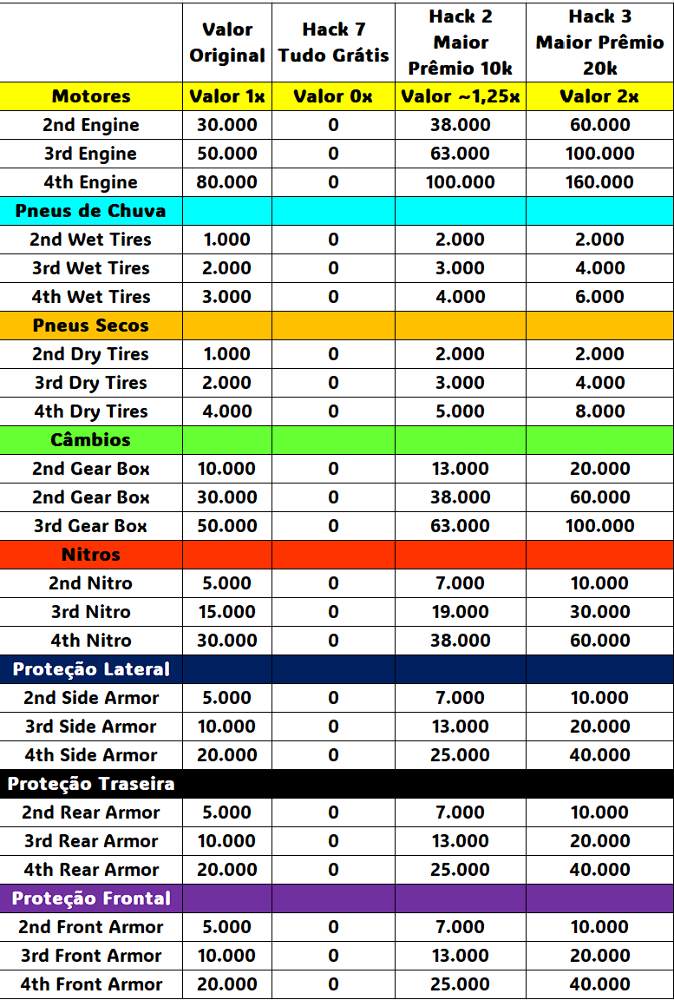

# **A Comunidade Leomarx Games Em Parceria com a TGC Apresenta:** #

# **Campeonato Hot Wheels Top Gear 2 Cenários 1.0 - 2026** #

# **LEIA TODAS AS REGRAS COM BASTANTE ATENÇÃO!!!** #

# **1. Inscrições:** #

1.1 - O modelo de inscrições de campeonatos da Leomarx Games terá sempre uma pré-lista de inscritos já validados e ativos conforme os participantes dos campeonatos recentes. Conforme Lista a seguir:

- Albert Matos (Suprem Peruvian)
- Aléxis Sánchez (ChitaMX)
- Alisson Paulo (Jack Maloi)
- Allan Live (Allan Live)
- Amélio Belchior (Amélio)
- Anderson Policarpo (Policarpo)
- Ari Júnior (Arijunino)
- Carlos José (Carlos CJX)
- Carlos Rubens (Carlos CRX)
- Casio Aquino (CFDA)
- Christopher Jp (Ceviche)
- Cristyan Antúnez (Crys90s)
- Brisantt (BR Brissant)
- Edimar Caetano (Pegasus PSX)
- Edson Silva (Senninkage)
- Edwin Huaylla (HD Wins)
- Irvin Delgado (Irvin 1988)
- Javier Portillo (Javier VZLA)
- Jeoanys Nogueira (KitLaska)
- Jhonny Mota (Jhonny)
- Jurandir Filho (Sr. Filho)
- Laynara Souza (UaiLay)
- Lenno Coelho (LeNN Miner)
- Leonardo Andrade (Leomarx Games)
- Lucas Souza (Killua)
- Luciano Alves (Luciano Bora Zerar)
- Luís Cárdenas (Luís L.A.O.M.)
- Marcel Santana (MMM)
- Marlon Fernandes (Camus Kshrc)
- Martins Pazos (Schumacher)
- Óscar Cárdenas (Goku L.A.O.M.)
- Paolo Paredes (Paomarc)
- Paulo Muniz (Paulo Fox)
- Petter Bruno (JackPoker40)
- Rafael Lopes (Rafael Diablo)
- Reeh Taylor (Fe & Har)
- Roberto Vasquez (The Mister)
- Robson Meireles (Rob Jax)
- Ronald Daniel (RonalDan)
- Samuel Barros (Barros)
- Vitor Gabriel (V11)
- Will Daga (Nacional)

1.2 - Novos participantes poderão se inscrever através de postagem realizada diretamente nos comentários do vídeo de divulgação do Torneio nas Redes Sociais da Comunidade TGC.

    Exemplo:
    Apelido/Nickname: LeomarxGames
    Disponibilidade para jogar: Descrever o melhor possível. Ex.: Disponibilidade das 19 as 23h30 durante a semana e finais de semana a combinar com antecedência.

1.3. Em seguida os novos inscritos deverão ingressar no grupo de WhatsApp do Campeonato pelo Link que será divulgado e se apresentar com o seu Nome Real + Apelido/NickName

# **2. Validação e Verificação de Perfil dos Inscritos:** #

2.1.	A administração da Leomarx Games, na intenção de criar um campeonato com credibilidade, se reserva no direito de solicitar a qualquer momento durante a inscrição e/ou durante o campeonato, informações adicionais a qualquer um dos inscritos em seus campeonatos.

2.2.	Tais medidas, vem com o intuito de impedir a inscrição ou participação de jogadores com contas fakes.

2.3.	As informações solicitadas servem para um processo de verificação/confirmação de identidade, tais como:

- Perfil de rede social com foto (Facebook/Instagram/WhatsApp/Discord/Telegram/Twitter/TikTok/Outras).
- Vídeo chamadas por qualquer uma das redes sociais mencionadas que o participante tenha conta.
- Detalhes técnicos e verificação do processo de conexão online (Hamachi/Radmin), compartilhando a tela. (TeamViewer/AnyDesk/Outros)
- Tipo de computador, fotos do modem, Empresa de internet, IP virtual, IP do roteador, VPN, etc.

2.4.	O jogador inscrito tem o **direito de não fornecer as informações solicitadas**, assim como a TGC, também se reserva ao **direito de cancelar a inscrição ou remover um participante durante um campeonato**, que não concorde em providenciar as informações que lhe forem solicitadas.

# **3. Itens Obrigatórios:** #

3.1 - **Emulador Null DC 1.96c =** Link para download [aqui](https://github.com/RossenX/NullDC-BEAR/releases/tag/1.96c)

3.2.  **Emulador ZSNES 1.36 =** Link para download [aqui](https://www.zsnes.com/index.php?page=files)

3.3.  **ROM Hack abaixo:**

Top Gear 2 - Hack1 USA - LeomarxGames = ROM Americana + 20 pontos										
										
Top Gear 2 - Hack2 USA - LeomarxGames = ROM Americana + 20 pontos + 10k Dinheiros + Equipamentos 1,25x										
										
Top Gear 2 - Hack3 USA - LeomarxGames = ROM Americana + 20 pontos + 20k Dinheiros + Equipamentos 2x										

Top Gear 2 - Hack7 USA - LeomarxGames = ROM Americana + 20 pontos + Nitro Infinito + Equipamentos Grátis

3.4.  **Radmin para conexão entre os jogadores** = Link para download [aqui](https://www.radmin-vpn.com/)

3.5.  **Hamachi para conexão entre os jogadores** = Link para download [aqui](https://vpn.net/)

# **4. Cronograma (Previsão):** #

4.1. As inscrições serão aceitas até às 20h do dia 22/02/2026, podendo ser encerrado antes dependendo do número de inscritos;

4.2. Após confirmação das inscrições, será realizado o sorteio dos grupos e países, sendo liberada a Fase de Grupos;

4.3. Fase de grupo: até 03/11 às 23:59;

4.4. Quartas de Final: até 10/11 às 23:59;

4.5. Semifinal: até 17/11 às 23:59;

4.6. Final de Disputa de 3º Lugar: até 24/11 às 23:59.

4.7 **Observação:** As rodadas podem ter o prazo estendido ou reduzido, caso a administração julgue necessário.

# **5. Organização e Chaveamento:** #

5.1. Será utilizado o TOORNAMENT para chaveamento das partidas do campeonato. [Hot Wheels Top Gear 2 Cenários 1.0 - 2026](https://play.toornament.com/en_US/tournaments/2320854530518775807/)

5.2. O campeonato terá uma fase de grupos no modelo Copa do Mundo e os melhores colocados avançam para a fase final de mata-a-mata.

5.3. Os jogadores pontuarão de acordo com seu resultado em cada partida de acordo com a relação a seguir:

- Vitória = 3 pontos;
- Empate = 1 ponto;
- Derrota = 0 pontos;
- W.O. unilateral = -1 ponto para o desistente e 3 pontos para o piloto vencedor;
- W.O. duplo = 0 pontos para ambos.
  
5.4. A classificação se dará pelo maior número de pontos. Em caso de empate os critérios de desempate serão:

- Confronto direto;
- Pontos conquistados;
- Saldo de pontos;
- Menor número de W.O.'s;
- Sorteio.

5.5. Todos os cenários pelo menos 1x para cada rodada na fase de grupos.

5.6. Nas fases mata-mata, serão sorteados 3 cenários para as oitavas, quartas e semifinais. Vence aquele que tiver a maior soma de pontos no final de todos os cenários

5.7. Na final e disputa de 3º, serão jogados todos cenários para a disputa. Vence aquele que tiver a maior soma de pontos no final de todos os cenários

5.8. Para todas as fases mata-mata, será sorteado um cenário para desempate.

5.9. Em caso de empate reinicia-se a ROM e joga a partir do cenário sorteado para desempate:

- Vencerá aquele que ao final do cenário tiver mais pontos de vantagem; 
- Permanecendo o empate no primeiro cenário, o cenário seguinte deverá ser jogado e assim sucessivamente, até haver um vencedor;
- Obs.: Em comum acordo, os jogadores podem trocar de controle quanto forem iniciar o desempate para corrigir o grid de largada corretamente. Caso não haja consenso, será o player 1, aquele que tiver terminado na frente na pista anterir ao desempate.

5.10. A substituição de jogadores só será adimitida, caso o piloto substituto ainda possa realizar mais da metade das partidas da fase de grupos:
- Exemplo: Se a fase de grupos tiver 4 ou 5 partidas, só poderá haver substituto, caso ainda hajam 3 partidas para serem realizadasda. Se a fase de grupos tiver 6 ou 7 participantes, só poderá haver substituto, caso ainda hajam 4 partidas para serem realizadas.
- Se não houver substituto, será aplicado w.o. para todas as partidas daquele piloto, com pontuação máxima para o adversário e mínima para o desistente.

5.11. A partir de 50% da partida realizada, o piloto pode avisar ao oponenete que deseja parar e admitir a derrota. Assim, o adversário leva os 20 pontos de cada pista restante e o desistente fica com zero pontos nas mesmas. Para este caso, a partida não será considerada w.o e não haverá sansões.

5.12. A quantidade de participantes em cada grupo, vai depender do número de inscritos confirmados, Exemplos:
- 16 pilotos: 4 grupos com 4, avançando os 2 primeiros;
- 20 pilotos: 4 grupos com 5, avançando os 2 primeiros;
- 24 pilotos: 4 grupos com 6, avançando os 2 primeiros;
- 28 pilotos: 7 grupos com 4, avançando os 2 primeiros de cada grupo e + 2 terceiros melhores;
- 32 pilotos: 8 grupos com 4, avançando os 2 primeiros;
- Outros formatos poderão ser definidos dependendo do número de inscritos. 

5.13. A tolerância de W.O's neste campeonato será no total de 2 partidas na fase de grupos se houver 3 ou mais partidas o piloto será impedido de participar do próximo campeonato de estação. Até o final do prazo da fase de grupos, será oportunizado ao piloto que apresente justificativas, caso as justificativas sejam aceitas, o W.O. não será contabilizado para efeitos de punição.

# **6. Cenários** #

## **Cenário 1 - Novas Estratégias - Ajuste de Pontuações Apenas:** ##
**ROM Hack1 Requerida**

Com a nova fórmula de pontuação, igual do jogo Top Gear 1, Qual seria o seu resultado ?

Modificação: Pontuações até o 10th. Dinheiro como sempre.

Objetivo: Jogar normalmente os países sorteadas e tentar o seu novo melhor com mais pontos e mais dinheiro. Lista abaixo:

- 01° - 20 pts. - 10k USD
- 02° - 15 pts. - 06k USD
- 03° - 12 pts. - 04k USD
- 04° - 10 pts. - 03k USD
- 05° - 08 pts. - 02k USD
- 06° - 06 pts. - 01k USD
- 07° - 04 pts. - 00k USD
- 08° - 03 pts. - 00k USD
- 09° - 02 pts. - 00k USD
- 10° - 01 pts. - 00k USD

## **Cenário 2 - Novas Estratégias - Ajustes de Pontuações + Dinheiro e Equipamento mais caros 1,25X:** ##
**ROM Hack2 Requerida**

Com a nova fórmula de pontuação, igual do jogo Top Gear 1, Qual seria o seu resultado ?

Modificação: Pontuações e Dinheiro até o 10th. Dinheiro com maior distribuição. Equipamento mais caros 1,25X.

Objetivo: Jogar normalmente os países sorteadas e tentar o seu novo melhor com mais pontos e mais dinheiro. Lista abaixo:

- 01° - 20 pts. - 10k USD
- 02° - 15 pts. - 09k USD
- 03° - 12 pts. - 08k USD
- 04° - 10 pts. - 07k USD
- 05° - 08 pts. - 06k USD
- 06° - 06 pts. - 05k USD
- 07° - 04 pts. - 04k USD
- 08° - 03 pts. - 03k USD
- 09° - 02 pts. - 02k USD
- 10° - 01 pts. - 01k USD

## **Cenário 3 - Novas Estratégias, Pontuações e Dinheiro:** ##
**ROM Hack3 Requerida**

Com a nova fórmula de pontuação, igual do jogo Top Gear 1, Qual seria o seu resultado ?

Modificação: Pontuações e Dinheiro até o 10th. Dinheiro com dobro. Equipamentos mais caros 2x.

Objetivo: Jogar normalmente os países sorteadas e tentar o seu novo melhor com mais pontos e mais dinheiro. Lista abaixo:

- 01° - 20 pts. - 20k USD
- 02° - 15 pts. - 15k USD
- 03° - 12 pts. - 12k USD
- 04° - 10 pts. - 10k USD
- 05° - 08 pts. - 08k USD
- 06° - 06 pts. - 06k USD
- 07° - 04 pts. - 04k USD
- 08° - 03 pts. - 03k USD
- 09° - 02 pts. - 02k USD
- 10° - 01 pts. - 01k USD

## **Cenário 4 - Velozes e Furiosos 2093:**
**ROM Hack7 Requerida**

100 anos depois do lançamento do jogo, já seria possível ter Nitros Infinitos e Equipamentos no máximo? Simm, Seu desejo virou uma ordem!!! Corridas eletrizantes e adrenalina a mil com super velocidades acima de 300km/h.

Bata todos os records de tempo do Guinness Book se os bots deixarem é claro. Quero ver tangências de curvas sem tirar o pé do acelerador, hahaha! 

Sua chance de dar uma ou duas voltas em cima do Ritchie.

Modificações: Novo sistema de Pontuação + Nitros Infinitos e Equipamento no máximo, exceto proteção. Cuidado para não quebrar o carro.

Objetivo: Jogar normalmente as pistas sorteadas e emendar um nitro atrás do outro.

## **Cenário 6 - Efeito Borboleta, cada novo dia um início diferente:**
**ROM Hacks 2,3 e 7 Requeridas**

Modificação: Nenhuma

Objetivo: Jogar 4x a primeira pista do país sorteado com mais dinheiro, mas não podendo repetir a configuração.

**Detalhes:**
- Terá um sorteio de 2 a 16 que representará país a ser jogado. Austrália não entra.
- Deverá ser jogada por 4x a primeira pista do país, anotando o resultado e fazendo o load state.
- Fazer save state antes da compra dos equipamentos.
- Após a compra avisar no chat o seu oponente a configuração realizada... assim tbm facilitará o VAR
- Não se poderá repetir a configuração
- Exemplos práticos começando com 80k em um determinado país:
  - Primeira vez Motor de 80k + Gearbox 0 + Nitro 0;
  - Segunda vez Motor 0 + Gearbox de 50 + Nitro de 30;
  - Terceira vez Motor de 30 + Gearbox de 30 + Nitro de 15;
  - Quarta vez Motor de 50 + Gearbox de 10 + Nitro de 5;

**Tabela Guia Cenários**

# **7. Comunicação:** #

  7.1 - Serão criados grupos no WhatsApp para cada um dos grupos sorteados, sendo este o canal oficial para as marcações das partidas e divulgação de resultados.

  7.2 - A permanência no grupo é obrigatória e o jogador que não participar poderá ser eliminado do campeonato. Caso o piloto tenha problemas de conexão com o WhatsApp, este deverá **imediatamente notificar a todos os admins** por meio de outra rede social e então será avaliada a possibilidade da continuação do mesmo sem o uso do App.

  7.3 - O grupo deve ser usado para os anúncios da administração, agendamento de partidas e assuntos relevantes ao campeonato, tais como informações de problemas com conexão, remarcação de partidas, encaminhamentos de links das lives e postagem de resultados.

  7.3 - Os jogadores podem mencionar seu oponente, marcando com @, para agendamento de sua partida. Essa menção poderá ser realizada quantas vezes o jogador quiser, mas para efeitos de regras de verificação para wo, só será considerada uma menção a cada 48 horas. Após a terceira menção do oponente (144h), sem uma a devida resposta, o jogador poderá reivindicar o W.O à administração.

  7.4 - Os participantes que não realizarem suas partidas ou agendamento delas nos prazos estabelecidos, através do grupo oficial do campeonato, receberão W.O.

  7.5. O W.O. será atribuído a favor daquele que oferecer maior tempo de disponibilidade, ou contra aquele que não comparecer no horário previamente agendado.

  7.6 - Em casos onde houver incompatibilidade total de horários entre os participantes, na análise de W.O., será priorizado aquele que esteve mais tempo disponível após às 18h ou finais de semana.

  7.7 - O envio de mensagens no chat do emulador estará proibido caso um dos participantes solicite no início da partida.

  7.8 - Os resultados das partidas devem ser informados no grupo respectivo do WhatsApp que o jogador for adicionado.

  Exemplo de postagem de resultado:

    - **Grupo A - Rodada 4**
    - **@Player1 110 x 100 @Player2**
    - **Link da live ou link do arquivo da gravação.**

  7.9 - O jogador que enviar mensagens sem relevância para grupo WhatsApp do campeonato, poderão ser advertidos e/ou eliminados do campeonato, conforme a nova Regra de Punição Acumulativa, Semelhante ao futebol ⚽, a seguir:

  7.9.1 - Haverá uma 1° primeira advetência verbal... 🗣
  
  7.9.2 - Após isso se houver reincidência... Uma punição de cartão amarelo 🟨 será dada. 
  
  7.9.3 - Sendo que 3 cartões Amarelos 🟨 acumulados = 1 Vermelho 🟥

  7.10 - A soma valerá para o torneio como um todo, caso o Vermelho 🟥 ocorra na fase de grupo ou nas fases finais, o piloto será eliminado do campeonato e também será penalizado com a perda por W.O. nos jogos restantes.

  7.11 - Mesmo que a msg seja apagada pelo piloto infrator posteriormente ao envio, se um dos adms visualizar a infração ela poderá ser executada da mesma maneira.

  7.12 - E se a figurinha ou mensagem irrelevante tiver um tom racista, conforme a lista da regra 8 (Regras de Conduta), o piloto receberá um cartão vermelho direto.

# **8. Regras de Conduta** #

8.1. É passível de eliminação do campeonato, mensagens ofensivas que se enquadrem em pelo menos um dos tipos de discriminação abaixo, dirigidos ao jogador ou à sua família:

- Racial ou étnica;
- Gênero ou Religião;
- Status social;
- De idade;
- Deficiência;
- Difamação ou calúnia;
- Nacionalidade, Naturalidade, ou Lugar onde mora, ou nasceu.

8.2. OBSERVAÇÕES: Mensagens trocadas em redes sociais particulares não serão consideradas. Denúncias e reclamações por ofensas somente serão consideradas e julgadas pela administração, se ocorrerem nos CANAIS OFICIAIS da Leomarx Games (Youtube, WhatsApp, Discord, YouTube, Twitch, Instagram e outros) ou no chat da transmissão oficial de uma partida válida do campeonato. Chats privados (PV) e quaisquer outros meios não serão considerados. Caracterizada a ofensa desrespeitosa com a dignidade da pessoa, a administração se reserva exclusivamente à punição de exclusão do campeonato.

8.3. Outras medidas referentes a processos legais, deverão ser adotadas pelo próprio requerente. 

8.4. Para protocolar a reclamação, os print’s das mensagens ou áudios (enviados no período de realização do campeonato, nas redes oficiais da Leomarx Games), devem ser encaminhados através de protocolo conforme modelo no item a seguir, no post de inscrição do campeonato ou no PV de um dos ADMs, com a hashtag #PROTOCOLO e deverá ser respondido pela administração em um prazo máximo de 3 dias úteis.

8.5. **Modelo de protocolo:** 

    PROTOCOLO DE JULGAMENTO DE CONDUTA NOME DO CAMPEONATO:
    - NOME DO CAMPEONATO:
    - NOME DO SOLICITANTE:
    - NOME DO OPONENTE:
    *SOLICITAÇÃO: Solicito que os administradores da Leomarx Games julguem se a conduta a seguir é caracterizada como discriminação conforme previsto no item de Regras de Conduto e seus subitens.*
    *ACUSAÇÃO: descrever a alegação de forma sucinta.*
    *ANEXOS: encaminhar as imagens, vídeos e áudios que julgar relevante no tópico aberto ou no privado dos administradores*

# **9 - Premiação de Troféus do Campeonato** #

9.1 - A inscrição e a participação no campeonato é gratuita.

9.2 - A confecção de troféus de acrílicos tem o custo de +ou- R$ 120.

9.3 - Após o encerramento das inscrições a ADM da Leomarx Games fará enquete no grupo de participantes sobre a opinião de divisão de custos entre todos os Brasileiros.

9.4 - Não serão enviados troféus para o exterior (México, Peru ou Venezuela, por exemplo). O participante poderá procurar fazer a confecção de forma local, com base na arte que será produzida.

9.5 - Aprovando a divisão de custos de fabricação dos troféus, os 3 brasileiros mais bem colocados, receberão os troféus.

**9.6 - Entrega da Premiação:** Após o campeonato, os vencedores devem indicar um nome/nick com até 15 caracteres para a confecção do troféu personalizado com seu nome, e quando estiver pronto o participante ganhador **deve arcar com os custos de frete do troféu** saindo de São Paulo, Brasil para o seu endereço. (Simular frete saindo do CEP 03510-000). Dúvidas entre em contato pelo WhatsApp no PV ou no grupo do campeonato.

9.7 - O participante que receber o troféu se compromete a seguir/curtir/inscrever-se em todas as redes sociais da Leomarx Games e fazer um vídeo e mencionar o canal e todas as redes abaixo nas suas postagens e/ou de lives das partidas:

Link das Redes:

<https://www.facebook.com/groups/mestresdotopgear2>

<https://youtube.com/@LeomarxGames>

<https://www.facebook.com/LeomarxGames>

<https://www.instagram.com/leomarxgames>

<https://twitter.com/LeomarxGames>

<https://www.twitch.tv/leomarxgames>

<https://www.tiktok.com/@leomarxgames>

# **10 - Regras Gerais das Corridas: Leia com bastante atenção**

10.1 - O campeonato será no modelo *Racha* (Modelo que é permitido fechadas). Então as regras tenha atenção as regras relacionadas a este item descritas abaixo.

10.2 - Apesar das fechadas estarem liberadas a administração estará a disposição para realização de "VAR" das partidas e eventuais dúvidas.

10.3 - A coleta e uso dos nitros é livre e não serão controladas neste campeonato.

10.4 - A coleta do dinheiro na pista é livre, porém tenha atenção ao sorteio do equipamento proibido e/ou equipamento obrigatório.

# **Fechadas / Bug de Fechadas** #

10.5 - Permitido aos pilotos ficarem mudando o trajeto propositalmente para fechar.

# **Medidas Anti-Jogo:** #

10.6 - Se o carro quebrar é proibido ficar batendo mais o carro propositalmente para perder mais posições e obter vantagem de largar na frente na pista seguinte;

10.7 - Se o carro quebrar é proibido diminuir a marcha do carro propositalmente para perder mais posições e obter vantagem de largar na frente na pista seguinte;

10.8 - Proibido o uso do freio para prejudicar o adversário de maneira proposital e desleal;

10.9 - Proibido a desaceleração do carro ou parar totalmente o carro na pista antes do combustível acabar ou antes de aparecer Race Over na tela;

10.10 - Proibido o uso da marcha Ré, exceto se, no caso de batidas na entrada de túnel/parede na qual é realmente necessário dar Ré para evitar bater no muro novamente ou situações similares;

10.11 - As punições no caso da ocorrência de atitudes anti desportivas as citadas, podem variar de zeramento da pontuação da pista atual ou seguinte ou até mesmo eliminação do campeonato a ser julgado pela ADM do torneio.

# **Itens de Super:**
Os itens de “Super” (S) poderão/serão coletados normalmente uma vez que ambos os jogadores terão a mesma oportunidade de obter ele.

# **Race Over/Game Over:**
Devido ao nível do jogo Championship ser elevado e haver alguns equipamentos proibidos e/ou obrigatórios, os equipamentos “base” da tabela às vezes serão inferiores ao necessário para aquele país, e então, poderá ocorrer fim jogo de forma inesperada durante uma das 8 pistas. Para contornar esse problema segue as observações: 

  - **Observação A**: Se o Race Over ocorrer em qualquer pista, poderá ser tentado jogar a mesma novamente por mais 2x. Total de 3 tentativas.

  - **Observação B:** Se o Race Over permanecer após as duas tentativas adicionais. Deve-se encerrar o jogo e, então, considerar se a pontuação obtida de ambos até a pista atual.
    
# **Regras de W.O. e desistência:**

  - A vitória por W.O dará ao vitorioso a pontuação média por partida. (5 pontos por pista) e a derrota por W.O. dará ao derrotado zero na pontuação por cada pista da partida.

  - **Observação A:** Se um dos jogadores desistir em meio a disputa, será atribuído a ele zero na pontuação das pistas restantes. E ao vitorioso será atribuído a somatória da pontuação máxima das pistas restantes (5 pontos por pista)

  - Toda e qualquer decisão da administração quanto à aplicação de W.O. será baseada exclusivamente pelas comunicações feitas pelo meio comunicação oficial do campeonato (WhatsApp).

  - **Observação B:** Havendo necessidade a administração poderá intervir no sistema de saldo/pontos para que os o W.O.’s não prejudique o torneio.
  - 
# **11. Validação das partidas:** #

11.1 - **Responsabilidade Individual de Gravação**. Todos os pilotos são obrigados a gravar ou transmitir ao vivo as suas próprias partidas, seja pelo OBS Studio, ou Emulador ou celular filmando a tela. Não é necessário perguntar ao oponente quem vai gravar ou transmitir.

11.2 - **Resultados e Responsabilidade do Vencedor**. O jogador vencedor é responsável por postar o resultado final da partida, juntamente com o vídeo e os detalhes de carro utilizados.

11.2.1 - Caso houver algum bug durante a partida, o outro piloto pode complementar com alguma informação importante os detalhes da partida.

11.3 - A resolução ideal é em HD 1280x720 (720p), porém para aqueles que não tenham um computador que consiga gravar ou transmitir nessa resolução, a resolução mínima aceita será (SD) 854 x 480 (480p).

11.4 - A partida deve ser disponibilizada em uma rede social no formato de vídeo (Facebook, Youtube, Twitch, Google Drive, etc.) e que não expire até o final do campeonato.

11.5 - Os pilotos que gravarem por emulador em ZMV deverão converter posteriormente a partida em vídeo.

11.6 - Não serão aceitos resultados enviados sem o cumprimento das regras de gravação mencionadas e que não contenham pelo menos 60% das pistas disputadas.

11.7 - Caso o vencedor da partida não poste o resultado com vídeo dentro do prazo final, a partida será considerada como desistência, e então ele e o outro piloto **receberão o placar final será 0x0 e 0 pontos, sem a soma de pontos de empate ou subtração de pontos naquela rodada**.

11.8 - Não serão aceitas reclamações ou protocolos sobre falhas de hardware, por exemplo, quando o controle desconecta o bluetooth ou acaba a bateria no meio da partida. Sendo de responsabilidade do piloto fazer essa validação antes da partida oficial.

11.8.1 - Caso esse tipo de problema aconteça, a orientação é que o confronto deverá ser reiniciado a partir da pista seguinte. Ambos poderão refazer o jogo a partir da pista onde ocorreu o problema, somente se o piloto que não teve problemas assim desejar.

# **12. Situações inéditas** #

12.1. Situações inéditas podem ocorrer e os casos não previstos aqui serão analisados pela administração no decorrer do campeonato.

12.2. **As regras podem ser aditadas durante o campeonato, caso a administração julgue necessário para cobrir casos que não forem cobertos por essas regras buscando não prejudicar os participantes.**

# **A administração da Leomarx Games desejam à todos um excelente campeonato e principalmente muita diversão a todos os participantes e expectadores!!!** #
