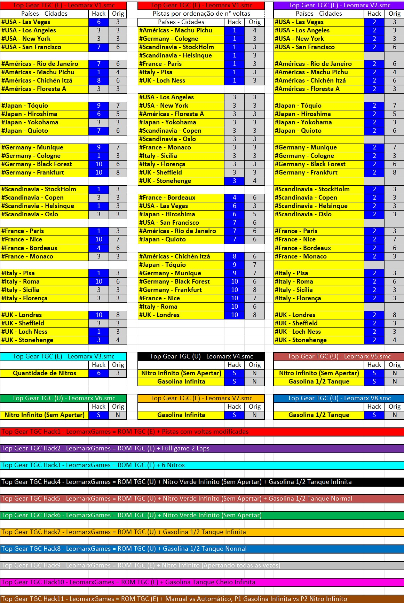

# **A COMUNIDADE TOP GEAR CHAMPIONSHIPS (TGC) APRESENTA:** #

## **TGC Prototype Challenge 6.0 - REGRAS ESPECÍFICAS** ##

## **LEIA TODAS AS REGRAS COM BASTANTE ATENÇÃO!!!** ##

## **1. CRONOGRAMA** ##

1.1 - A fase de grupos começará em XX/XX/2026 e terá prazo previsto até às 23h59 do dia XX/XX/2026.

1.2 - O prazo para realização das Oitavas será até às 23h59 do dia XX/XX/2026.

1.3 - O prazo para realização das Quartas será até às 23h59 do dia XX/XX/2026.

1.4 - O prazo para realização das Semifinais será até às 23h59 do dia XX/XX/2026.

1.5 - O prazo para realização da Final será até às 23h59 do dia XX/XX/2026.

**Observação:** As rodadas podem ter o prazo estendido caso a administração julgue necessário.

---

## 2. ORGANIZAÇÃO E CHAVEAMENTO

### 2.1 Plataforma
Será utilizado o TOORNAMENT para chaveamento das partidas.

### 2.2 Formato
Copa do Mundo com grupos iniciais (Fase de Grupos, Oitavas, Quartas, Semifinal e Final).

### 2.3 Itens Obrigatórios
- **Kit de ROMs Hack a seguir:**
- **Emulador ZSNES 1.42**

### 2.4 Cenários por Fase
- **Fase de Grupos:** Todos os cenários pelo menos 1x para cada rodada na fase de grupos.
- **Quartas de Final:** 3 Cenários
- **Semifinal:** 3 Cenários
- **Final:** Todos os cenários
- **Disputa de 3°:** Todos os cenários

### 2.5 Carros
Carro **VERMELHO** em todas as fases do campeonato.
Carro **LIVRE** na fases de grupo do campeonato.
Carro **LIVRE (com exceção do Proibido) + COMISSÁRIO** na fases mata-mata do campeonato.

### 2.6 Desempate
- Em caso de empate, jogar o cenário definido para desempate. 
- Permanecendo o empate no primeiro cenário, o cenário seguinte deverá ser jogado e assim sucessivamente, até haver um vencedor;

### 2.7 Substituição de Jogadores
Durante o campeonato não haverá substituição de jogadores, aqueles que desistirem receberão W.O. para todas as suas partidas.

### 2.8 - Impedimentos
Só poderão participar deste torneio, aqueles jogadores que forem inscritos na Comunidade TGC e não estiverem cumprindo punição vigente que impeça a participação em campeonatos.

---

## 3. PONTUAÇÃO

### 3.1 Sistema de Pontos
- **Vitória:** 3 pontos
- **Empate:** 1 ponto
- **Derrota:** 0 pontos
- **W.O. unilateral:** -1 ponto (desistente) + 3 pontos (vencedor)
- **W.O. duplo:** 0 pontos para ambos

### 3.2 Classificação na Fase de grupos

- A quantidade de participantes em cada grupo, vai depender do número de inscritos confirmados, Exemplos:
  - 16 pilotos: 4 grupos com 4, avançando os 2 primeiros;
  - 20 pilotos: 4 grupos com 5, avançando os 2 primeiros;
  - 24 pilotos: 4 grupos com 6, avançando os 2 primeiros;
  - 28 pilotos: 7 grupos com 4, avançando os 2 primeiros de cada grupo e + 2 terceiros melhores;
  - 32 pilotos: 8 grupos com 4, avançando os 2 primeiros;
  - Outros formatos poderão ser definidos dependendo do número de inscritos

- A classificação se dará pelo maior número de pontos. Em caso de empate os critérios de desempate serão:

  - Confronto direto;
  - Pontos conquistados;
  - Saldo de pontos;
  - Sorteio.

### 3.3 Tolerância de W.O.
A tolerância de W.O's neste campeonato será no total de 2 partidas na fase de grupos
---

# **4. Cenários** #

## 4.1 - Cenário 1 - Novas Estratégias
**ROM Hack 1 Requerida:**  
 
### Descrição

E se o número de voltas mudasse completamente o ritmo das corridas?  
Neste cenário, o tradicional equilíbrio entre combustível, pneus e ritmo foi virado de cabeça pra baixo.  
Algumas pistas agora acabam antes do esperado - e outras parecem nunca terminar!

Os pilotos precisarão se adaptar às novas condições, repensar suas paradas e saber a hora certa de atacar.  
Aqui, estratégia vale mais que reflexo.

### Modificações / Condições de Corrida

Algumas pistas do jogo agora tem um número maior de voltas, outras pistas tem um número reduzido

### Objetivo

Jogar normalmente as pistas sorteadas e testar novas estratégias com o novo número de voltas.  
Quem dominar o ritmo e souber equilibrar agressividade e economia vai se destacar.

O “Novas Estratégias” é o cenário da mente fria e cálculo apurado.  
Com o número de voltas embaralhado, ninguém sabe se a vitória vem na arrancada ou na resistência.  
**Pense rápido, pilote com calma — e adapte-se, porque aqui o tempo não é igual pra todos.**

---

## 4.2 - Cenário 2 - Velozes e Furiosos 2092
**ROM Hack 5 Requerida:**  

### Descrição

E se o clássico Top Gear tivesse recebido o pacote completo do futuro?  
Aqui, o poder dos **Nitros Verdes** e a limitação de combustível trazem corridas insanas acima de **300 km/h**.

Tangências perfeitas, curvas feitas sem aliviar o pé e voltas rápidas dignas do **Guinness Book**.  
Se o Ritchie estiver na pista, é a hora de dar uma ou duas voltas nele!

### Modificações / Condições de Corrida

| Jogador | Câmbio | Nitro | Gasolina | Colisões com BOTs |
|----------|--------|--------|-----------|--------------------|
| **P1** | Livre (Manual ou Automático) | Nitros Verdes (Ativação Contínua) | ½ Tanque | Normal |
| **P2** | Livre (Manual ou Automático) | Nitros Verdes (Ativação Contínua) | ½ Tanque | Normal |

### Objetivo

Jogar normalmente as pistas sorteadas, explorando ao máximo o uso dos **Nitros Verdes** sem desperdiçar combustível.  
Vence quem demonstrar maior controle nas altas velocidades e desviar do bots com reflexo do flash.

### Resumo

O “Velozes e Furiosos 2092” é o modo futurista do campeonato: pura adrenalina, velocidade extrema e controle fino.  
Com meio tanque e nitros agressivos, cada curva vira uma luta contra o limite da pista e da máquina.  
**Aqui não se ganha apenas correndo — se ganha pilotando no limite.**

---

## 4.3 - Cenário 3 - Duelo das Marchas Apimentado: Manual vs Automático
**ROM Hack 11 Requerida**

Descrição: 

Um desafio de equilíbrio entre técnica e vantagem.  
O Player 1 (manual) confia na habilidade e domínio do câmbio, enquanto o Player 2 (automático) conta com recursos ilimitados, mas deve provar que consegue transformar isso em resultado real.

O duelo coloca frente a frente a precisão do “piloto raiz” contra o conforto do “piloto turbo”.

Este cenário testa o domínio real da condução manual frente à vantagem bruta do câmbio automático e nitro ilimitado.

P2 tem poder, mas precisa provar superioridade **com folga**.
P1, mesmo limitado, pode vencer pela técnica, precisão e consistência — como nos velhos tempos.

Neste Cenários serão jogos de ida e volta para que cada um prove seu valor.

### Modificações / Condições de Corrida

| Jogador | Câmbio | Nitro | Gasolina | Colisões com BOTs |
|----------|--------|--------|-----------|--------------------|
| **P1 (Manual)** | Manual | 6 Nitros | Infinita | **Não, Hack de Ghost só funciona para P1** |
| **P2 (Automático)** | Automático | Infinito | ½ Tanque | **Sim, Hack de Ghost só funciona para P1** |

### Objetivo

Com as vantagens concedidas, o **P2 deve vencer a corrida com ao menos +10 segundos de vantagem** sobre o P1.  
Caso não alcance essa margem mínima, será penalizado na pontuação final.

### Penalidades e Ajustes

- Se **P2 vencer com +10s ou mais**, mantém pontuação integral (**20 pts**).  
- Se **P2 vencer com menos de +10s**, perde **–10 pts** (ficando com **10 pts**).  
- Se **P1 vencer**, recebe **20 pts** e P2 **10 pts** (derrota sem vantagem atingida).  

### Exemplos de Resultado

| Resultado | P1 | P2 | Pontuação Final |
|------------|----|----|----------------|
| P1 1º / P2 2º | 20 | 10 | P1 vence |
| P1 2º / P2 1º (>+10s ou mais) | 15 | 20 | P2 vence |
| P1 2º / P2 1º (<10s) | 15 | 10 | P1 vence nos pontos |

---

## 4.4 - Cenário 4 - Estoy facilito e sajirito
**ROM Hack 3 Requerida:** 

### Descrição

Sabe aquele momento em que tudo parece fácil e o adversário só come poeira?  
Pois é, chegou o **“Estoy facilito e sajirito”** — o cenário onde vencer não basta, é preciso **vencer com autoridade**.

Ambos os jogadores começam com **6 nitros**, mas só o piloto que cruza a linha de chegada **com sobras no tanque de nitros** é reconhecido como o verdadeiro dominador da pista.

### Modificações / Condições de Corrida

| Jogador | Câmbio | Nitros | Gasolina | Colisões com BOTs |
|----------|--------|---------|-----------|--------------------|
| **P1** | Livre (Manual ou Automático) | 6 Nitros | Normal | Normal |
| **P2** | Livre (Manual ou Automático) | 6 Nitros | Normal | Normal |

### Objetivo

Vencer a corrida **usando a menor quantidade possível de nitros**.  
Cada nitro **que sobrar ao final da corrida** vale **+5 pontos de bônus**.  
Ou seja, quanto mais “sajirito” (leve no pé), e bom de fechada, maior a glória.

### Pontuação Bônus

- Cada **nitro não utilizado** pelo vencedor concede **+5 pontos extras**.  
- Apenas o **vencedor** recebe o bônus de nitros restantes.  
- O segundo colocado não ganha bônus, independentemente de sobras.

### Exemplos de Resultado

| Resultado | Nitros Restantes | Pontuação Base | Bônus | Pontuação Final |
|------------|-----------------|----------------|--------|----------------|
| 1º Lugar (3 nitros restantes) | 3 | 20 | +15 | **35 pts** |
| 1º Lugar (1 nitro restante) | 1 | 20 | +5 | **25 pts** |
| 1º Lugar (0 nitros restantes) | 0 | 20 | +0 | **20 pts** |
| 2º Lugar (qualquer sobra) | – | 15 | +0 | **15 pts** |

### Resumo

“Estoy facilito e sajirito” é o cenário da **eficiência e precisão**.  
Aqui, o piloto que vence com folga **e ainda guarda nitro** mostra quem realmente entende o espírito do Top Gear clássico:  
**ser rápido sem precisar abusar do botão.**

---

## 4.5 - Cenário 5 - Efeito Borboleta
**ROM Hack1 Requerida**

### Descrição

> “Dormammu, eu vim barganhar.”  
> “Dormammu, eu vim barganhar.”  
> “Dormammu, eu vim barganhar...”  

Entrou no **loop temporal do Doutor Estranho**? Pois é, nesse cenário você vai sentir na pele o que é viver o mesmo momento várias vezes.  

Aqui, a pista sorteada será repetida **diversas vezes seguidas**, e cada repetição testará não só sua habilidade, mas também sua resistência mental.  
Afinal, errar uma curva 10 vezes seguidas é um verdadeiro pesadelo místico.

### Modificações / Condições de Corrida

| Regra | Descrição |
|--------|------------|
| 🔁 **Repetição Aleatória de Corrida** | Um número entre **2 e 16** será sorteado para definir **quantas vezes** a **mesma pista** será jogada consecutivamente. |
| 🧭 **Seleção de Pistas** | Quanto maior o número sorteado, mais **simples e curtas** serão as pistas atribuídas. |
| 🎲 **Carro Sorteado** | Alguns cenários poderão ter o carro **previamente sorteado**, adicionando imprevisibilidade. |

### Estrutura de Sorteio e Exemplos

| Nº de Repetições | Tipo de Pista | Exemplo de Pista | Voltas (Hack) | Exemplo de Pior Caso |
|------------------|---------------|------------------|----------------|----------------------|
| 2 a 3x | Pistas longas (8 a 10 voltas) | Roma, Frankfurt | 10 | 3x Roma (10 voltas) |
| 4 a 6x | Pistas médias (4 a 7 voltas) | Rio de Janeiro, Quioto | 7 | 6x Rio (7 voltas) |
| 7 a 10x | Pistas curtas (3 voltas) | Stonehenge, Paris | 3 | 10x Stonehenge (3 voltas) |
| 11 a 13x | Pistas expressas (2 voltas) | Pisa, Floresta A | 2 | 13x Pisa (2 voltas) |
| 14 a 16x | Pistas ultracurtas (1 volta) | Colônia, Machu Pichu | 1 | 16x Colônia (1 volta) |

### Objetivo

Jogar a **mesma pista sorteada** o número de vezes definido pelo sorteio, mantendo desempenho consistente entre as repetições.  
O foco aqui é **constância**, não apenas velocidade — a meta é não deixar o erro se repetir, e a paciência vira sua maior aliada.

### Duração Média

Apesar de parecer um alto volume de corridas, as partidas **não devem ultrapassar 30 minutos totais**.  
Afinal, uma pista como Colônia com 1 volta leva cerca de **40 segundos** por tentativa.  
O desafio é mental — não de tempo.

### Resumo

O “Efeito Borboleta” é o cenário da **repetição e da consistência**.  
Cada erro é uma lição, e cada volta é uma chance de refazer o destino — ou repetir o mesmo erro infinitamente.

> **Domine o tempo, ou será dominado por ele.**

---

## 4.6 - Cenário 6  - Nitrar na Largada é Pecado
**ROM Hack 1 e Hack 2 Requeridas:**  

### Descrição

Tem gente que nem respira na largada e já mete o dedo no nitro.  
Pois neste cenário, **isso é pecado capital!**  

A ideia aqui é simples: controlar o instinto, segurar o dedo e mostrar que estratégia e calma também ganham corridas.
Será que o ditado é verdadeiro? > "Guardou o nitro, o bot veio!" Está na hora de descobrir.

### Modificações / Regras Especiais

| Regra | Descrição |
|--------|------------|
| 🚫 **Proibido usar Nitro na 1ª Volta** | Nenhum jogador pode acionar o nitro antes de iniciar a **2ª volta**. |
| 💣 **Penalidade** | Se o jogador usar **qualquer nitro antes da 2ª volta**, perde **5 pontos** na corrida. |
| ⚙️ **Nitros Livres** | Após a 2ª volta, o uso é livre. Segure até o momento certo — ou pague o preço. |

### Objetivo

Avaliar se a teoria clássica dos pilotos de que nitram na largada é verdadeira:  

O desafio é manter a calma, não ceder à tentação e provar que uma corrida bem controlada pode render mais que uma arrancada apressada.

### Pontuação Base (Padrão Campeonato)

| Colocação | Pontos | Observação |
|------------|--------|-------------|
| 🥇 1º Lugar | 20 pts | -5 pts se usar nitro antes da 2ª volta |
| 🥈 2º Lugar | 15 pts | -5 pts se usar nitro antes da 2ª volta |

Lembre-se: **disciplina vence impulso**.
“Nitrar na Largada é Pecado” é o cenário do **autocontrole e da paciência**.  
Quem segurar o dedo e usar o nitro no momento certo, vence.  
Quem não resistir... paga com pontos e com a vergonha.

**Controle o dedo. Pilote com a cabeça. E mostre que santo também ganha corrida.**

---
## 5. USAR AS REGRAS GERAIS PARA TODAS AS DEMAIS INFORMAÇÕES

- **Regras Gerais TGC** - Link 